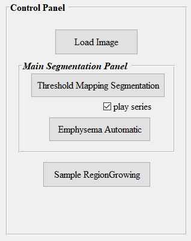
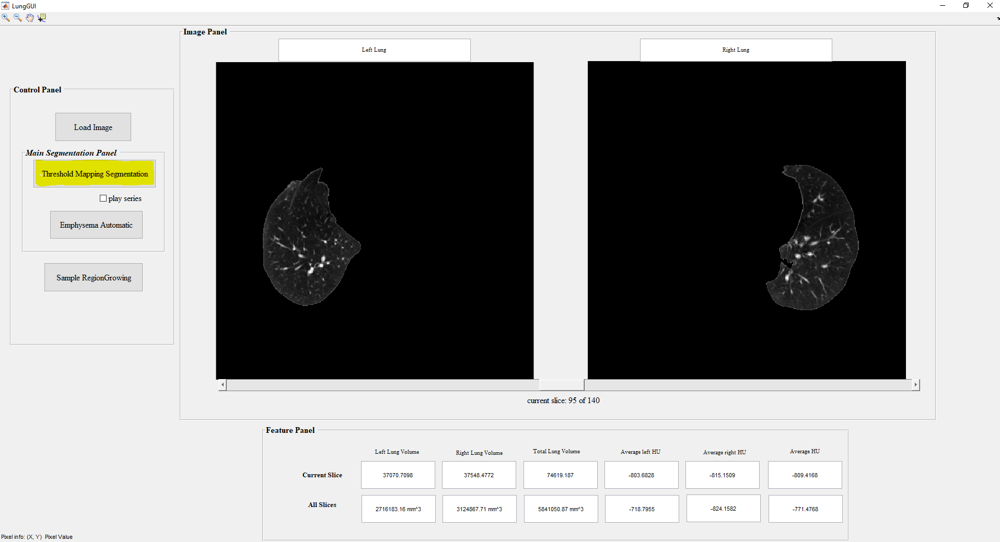
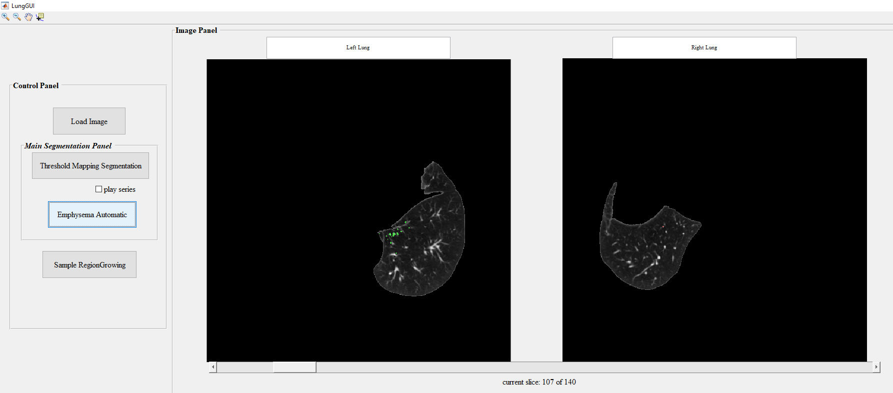

# Lung-GUI    
Developed a computer-aided image processing scheme with a graphic user interface (GUI) model to segment and quantify lung tumors and emphysema using lung CT images.   

**Background**: Lung cancer and chronic obstructive pulmonary disease (COPD) are two major lung diseases with high mortality rates. COPD is also an important risk factor of developing lung cancer. Emphysema is one of major components in COPD. In clinical practice, CT images are widely used to detect and diagnose lung cancer and COPD. However, reading and interpreting lung CT images by radiologists is difficult and has large inter-reader variability. Thus, to more accurately predict or assess prognosis of lung cancer or COPD, it is important to segment and quantify lung tumor and emphysema (volume and other image features).      

**Images/Dataset**: One lung CT case acquired from a public database of lung cancer (LIDC-IDRI-0003)          https://imaging.cancer.gov/informatics/lidc_idri.htm) is provided to develop this scheme and GUI. The total number of CT slice is 140 in this case. The size of each voxel (x, y, z) can be identified from DICOM header of the images.  

## User Manual
This manual helps to understand the LungGUI that can be used to segment the lungs from the Dicom images. In addition, it highlights emphysema using batch processing. LungGUI is also can be used to segment the tumor automatically and manually.
The GUI can be divided into three panels:
1.	Control Panel
2.	Image Panel
3.	Feature Panel   

**Control Panel**: It consists of four push buttons as shown in figure 1.    

   
 
*Load Image push button* loads all the images in the present working directory and displays using Image Panel. Figure 2 illustrates batch processing of GUI after the task completion.   

   

*Threshold Mapping Segmentation push button* uses thresholding at multiple levels to segment the left and right lung and displays using Image panel axis. In addition to segmenting, it also calculates several parameters which has high clinical significance such as left lung volume, right lung volume, total lung volume, average left HU value, average right HU value, average HU value.      

    

*Emphysema Automatic push button* helps in identifying emphysema pixels automatically using thresholding. Green color is used to identify emphysema pixels in left lung and red color is used to identify right lung as shown in fig 4.     

    

*Sample RegionGrowing push button* helps in segmenting the tumor using input from the user. User is expected to click once on the axis 1 (on left lung tumor) and on axis 2 (on right lung tumor) and then click enter, you can see the segmented tumor on both the axis.     

**Image Panel**: Image panel consists of two axes, that can be used to view left lung and right lung.   

    

